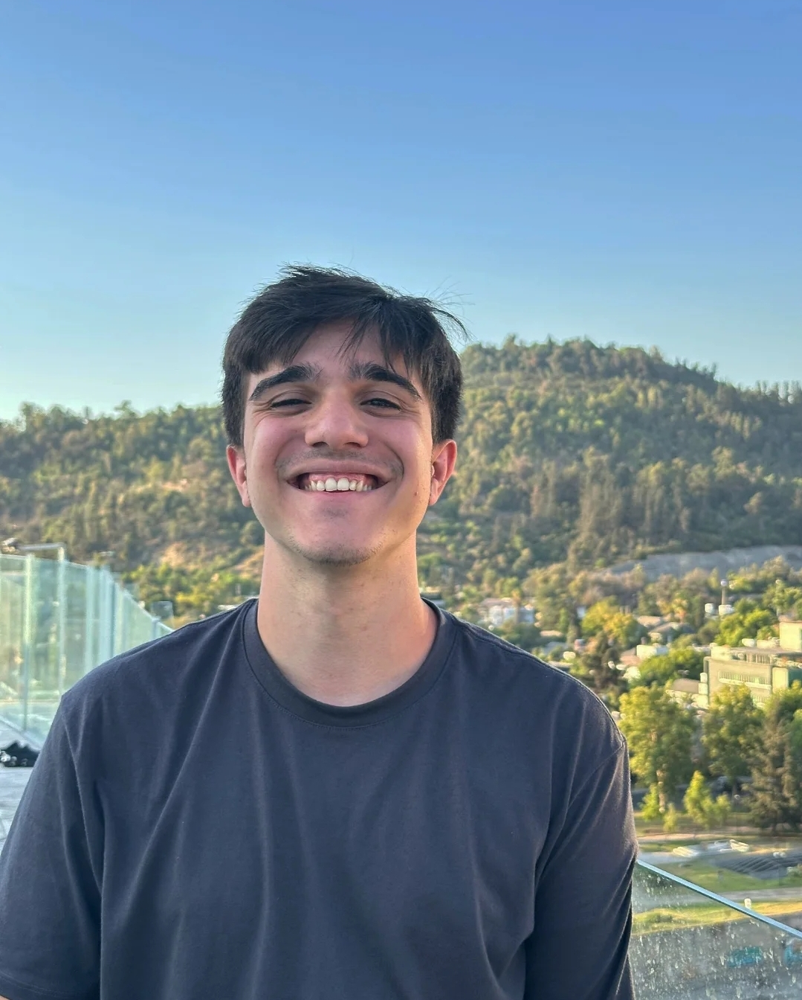

## Thiago Elías
**Legajo:** 222.286-3

**Sobre mi:** Tengo 18 años y este 2025 estoy empezando mi segundo año de cursada. Soy de Caballito y algunos de mis hobbies son leer, escribir, y si la billetera me lo permite, salir a merendar.
Además, me gusta mucho escuchar música, sobre todo artistas como Wos, Milo J y Andrés Calamaro.

**DATO EXTRA -->** me fascina leer y escribir ficción; uno de mis objetivos por fuera del ámbito tecnológico es algún día publicar un libro (sea novela, poemario, antología).

En cuanto a mi **libro favorito**, la verdad que no me puedo decidir por uno, pero mis favoritos son La Casa de Hades de Rick Riordan (parte del universo Percy Jackson), Al final mueren los dos de Adam Silveira y Matilde debe Morir de Cristian Acevedo. Si tuviera que **recomendarles** alguno, sería Matilde debe Morir o algún otro libro de Acevedo ya que me gusta mucho su forma de escribir y construir las historias (dato: es un autor argentino).

**Expectativas:** al ser una materia del área de Programación, me intriga bastante lo que vayamos a aprender; me gusta mucho programar pero no tengo tantos conocimientos y siento que con PdeP los voy a poder adquirir.

**- Una foto mía (un poco chinito salí)**

### Algo que me interesa del mundo:

Si nos centramos en cuestiones tecnológicas, ultimamente paso bastante tiempo viendo videos sobre Computación Cuántica y los avances que hay en el campo. Me parece muy loco cómo los límites de la tecnología se siguen extendiendo día, y me emociona pensar si podría llegar a utilizar dichas herramientas en mi día a día laboral.
